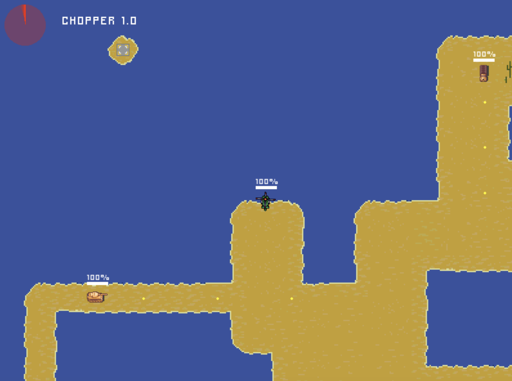

# 2d-game-engine
A basic 2d Game Engine made from scratch by following the Pikuma course using C++, SDL2, glm and Lua.
Visit [pikuma.com](https://pikuma.com/) for move information on the course.

The engine includes an ECS system, an event system and support for various game mechanics, like collisions and damage system. In addition a scripting system with Lua enables the creation of levels and entities without recompiling the game.

# Chopper game

The engine comes with a basic 2d game with three levels. The player can move a small helicopter and shoot projectiles to kill tanks, trucks and other types of enemies. Please beware that the game is incomplete and just for demonstration purposes.



# Libraries and dependencies
In order for the project to run you need to install the following packages on your machine:

* **Make** -> for building and running the game
* **Lua** -> for the scripting system. Please note, you need to update the `LINKER_FLAGS` section in `Makefile` with the specific version you are installing, e.g. 5.2. In addition if you are on Mac OS you need to remove the version from the flag, e.g. instead of `-llua5.3` you have to set it to `-llua`.
* **sdl2**, **sdl2_image**, **sdl2_ttf**, **sdl2_mixer** -> libraries to manage rendering of images, text and sound

E.g. on macOS run:
```
brew install lua sdl2 sdl2_image sdl2_ttf sdl2_mixer
```

# How to run the game
## Build
```
make build
```

## Run
```
make run
```

## Clean game executable file
```
make clean
```
